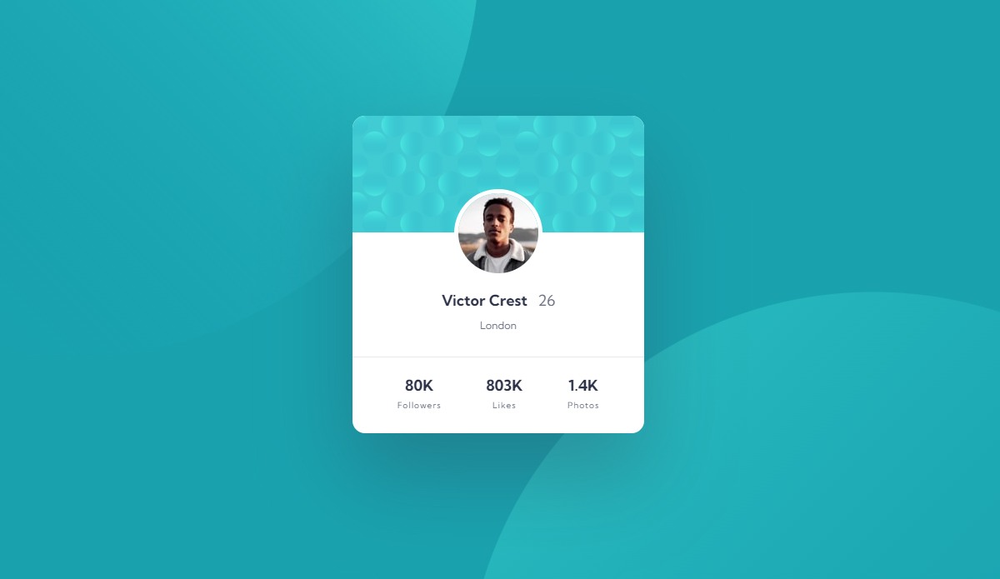

# Frontend Mentor - Profile card component solution

This is a solution to the [Profile card component challenge on Frontend Mentor](https://www.frontendmentor.io/challenges/profile-card-component-cfArpWshJ). Frontend Mentor challenges help you improve your coding skills by building realistic projects. 

## Table of contents

- [Frontend Mentor - Profile card component solution](#frontend-mentor---profile-card-component-solution)
  - [Table of contents](#table-of-contents)
  - [Overview](#overview)
    - [The challenge](#the-challenge)
    - [Screenshot](#screenshot)
    - [Links](#links)
  - [My process](#my-process)
    - [Built with](#built-with)
    - [What I learned](#what-i-learned)
  - [Author](#author)

## Overview

### The challenge

- Build out the project to the designs provided

### Screenshot



### Links

- Solution URL: [Add solution URL herehttps://github.com/KrzysztofGrudzien/frontend-mentor-profile-card-component-second](https://github.com/KrzysztofGrudzien/frontend-mentor-profile-card-component-second)
- Live Site URL: [https://krzysztofgrudzien.github.io/frontend-mentor-profile-card-component-second/](https://krzysztofgrudzien.github.io/frontend-mentor-profile-card-component-second/)

## My process

### Built with

- Semantic HTML5 markup
- CSS custom properties
- Flexbox
- BEM Methodology
- Mobile-first workflow

### What I learned

Basic knowledge about HTML and CSS properties using BEM Methodology.

```html
<main class="main">
    <div class="card">
        <div class="card__bg"></div>
        
        <div class="card__content">
            <p class="card__name"><strong>Victor Crest</strong> 26</p>
            <p class="card__city">London</p>
            <div class="card__description">
                <div class="followers">
                    <span class="followers__quantity">80K</span>
                    <p class="followers__name">Followers</p>
                </div>
                <div class="likes">
                    <span class="likes__quantity">803K</span>
                    <p class="likes__name">Likes</p>
                </div>
                <div class="photos">
                    <span class="photos__quantity">1.4K</span>
                    <p class="photos__name">Photos</p>
                </div>
            </div>
        </div>
    </div>
</main>
```
```css
.followers__quantity,
.likes__quantity,
.photos__quantity {
    color: var(--color-text);
    font-weight: 700;
}

.followers__name,
.likes__name,
.photos__name {
    font-size: 0.63rem;
    letter-spacing: 1px;
    padding-top: 0.5rem;
}

/* ------- MOBILE ------- */
@media screen and (min-width: 375px) and (max-width: 1439px) {
    .main {
        background-image: url(../images/bg-pattern-top.svg);
        background-position: top -550px left -750px;
        background-repeat: no-repeat;
        background-attachment: fixed;
    }

}
```

## Author

- Website - [In progress]
- Frontend Mentor - [@KrzysztofGrudzien](https://www.frontendmentor.io/profile/KrzysztofGrudzien)
- E-mail - krzysztof.grudzien.fed@gmail.com

